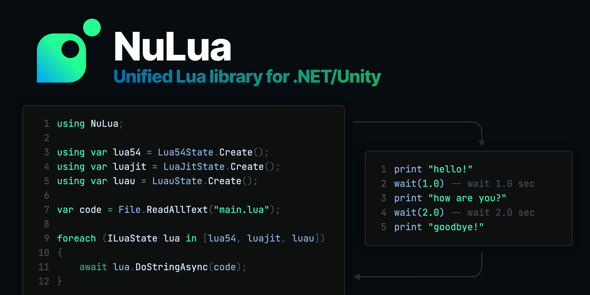

# NuLua

Unified Lua5.x/LuaJIT/Luau bindings for .NET and Unity

[](https://www.nuget.org/packages/NuLua)
[](https://github.com/nuskey8/NuLua/releases)
[](LICENSE)



English | [日本語](README_JA.md)

## Overview

NuLua (pronounced like "new Lua") is a new Lua library for .NET / Unity. It provides common abstractions for using Lua from C#, as well as bindings and high-level APIs for each runtime.

> [!CAUTION]
> This library is currently provided as a preview. It currently supports Windows/macOS/Linux only; iOS/Android/Web support is planned for the future.

## Features

- High-performance design that minimizes heap allocations on the C# side
- Modern, easy-to-use API design
- Choose the backend from Lua 5.1/5.2/5.3/5.4/5.5 and LuaJIT/Luau
- async/await support

## Installation

NuLua requires .NET Standard 2.1 or later.

All packages are distributed on NuGet. To use NuLua, install the core package plus the package for the runtime you want to use.

| Package      | Latest Version                                                |
| ------------ | ------------------------------------------------------------- |
| NuLua        |         |
| NuLua.Lua51  |   |
| NuLua.Lua52  |   |
| NuLua.Lua53  |   |
| NuLua.Lua54  |   |
| NuLua.Lua55  |   |
| NuLua.LuaJit |  |
| NuLua.Luau   |    |

Low-level binding APIs and pre-built native binaries can also be added separately. These are included as dependencies of each package, so users normally do not need to install them manually.

| Package              | Latest Version                                                        |
| -------------------- | --------------------------------------------------------------------- |
| NuLua.Runtime.Lua51  |   |
| NuLua.Runtime.Lua52  |   |
| NuLua.Runtime.Lua53  |   |
| NuLua.Runtime.Lua54  |   |
| NuLua.Runtime.Lua55  |   |
| NuLua.Runtime.LuaJit |  |
| NuLua.Runtime.Luau   |    |
| NuLua.Interop.Lua51  |   |
| NuLua.Interop.Lua52  |   |
| NuLua.Interop.Lua53  |   |
| NuLua.Interop.Lua54  |   |
| NuLua.Interop.Lua55  |   |
| NuLua.Interop.LuaJit |  |
| NuLua.Interop.Luau   |    |

## Platforms

| Platform | Architecture | Supported |
| -------- | ------------ | --------- |
| Windows  | x64          | ✅         |
|          | arm64        | ✅         |
| macOS    | x64          | ✅         |
|          | arm64        | ✅         |
| Linux    | x64          | ✅         |
|          | arm64        | ✅         |
| iOS      |              | 🚧         |
| Android  |              | 🚧         |
| Web      |              | 🚧         |

## Quick Start

```cs
using NuLua;
using NuLua.Lua54;

using var state = Lua54State.Create();
state.OpenLibraries();

var results = state.DoString("return 1 + 2");
Console.WriteLine(results[0]); // 3
```

> [!WARNING]
> `ILuaState` is not thread-safe. Do not access it from multiple threads simultaneously.

## LuaValue

In NuLua, values inside Lua are represented by the `LuaValue` struct. They can be read with `Read<T>()`.

```cs
LuaValue value = state.DoString("return 42")[0];
Console.WriteLine(value.Type);        // Number
Console.WriteLine(value.Read<int>()); // 42
```

The type mappings between Lua and C# are shown below.

| Lua             | C#                        |
| --------------- | ------------------------- |
| `nil`           | `LuaValue.Nil`            |
| `boolean`       | `bool`                    |
| `lightuserdata` | `IntPtr`                  |
| `number`        | `double`, `float`         |
| `string`        | `string`                  |
| `table`         | `LuaTable`                |
| `function`      | `LuaFunction`             |
| `userdata`      | `T, LuaUserData`          |
| `thread`        | `ILuaState`               |
| `vector` (Luau) | `System.Numerics.Vector3` |
| `buffer` (Luau) | `LuauBuffer`              |

When creating a `LuaValue` from C#, convertible types are implicitly converted to `LuaValue`.

```cs
LuaValue value;
value = 1.2;                 // double   ->  LuaValue
value = "foo";               // string   ->  LuaValue
value = state.CreateTable(); // LuaTable ->  LuaValue
```

## ILuaState

NuLua provides `ILuaState` as an abstraction over Lua runtimes.

```cs
ILuaState lua55 = Lua55State.Create();
ILuaState luaJit = LuaJitState.Create();
ILuaState luau = LuauState.Create();
```

This makes it easy to swap the backend runtime without having to account for differences between versions.

## Libraries

You can load the standard libraries by calling `OpenLibraries()`. Individual libraries can also be loaded selectively.

```cs
state.OpenLibraries();

state.OpenBaseLibrary();
state.OpenPackageLibrary();
state.OpenTableLibrary();
state.OpenStringLibrary();
state.OpenMathLibrary();
state.OpenCoroutineLibrary();
state.OpenIoLibrary();
state.OpenOsLibrary();
state.OpenUtf8Library();
```

## Global Environment

You can access the Lua global environment using the indexer.

```cs
state.DoString("""
    foo = 10
    bar = "hello"
    """);

Console.WriteLine(state["foo"]); // 10
Console.WriteLine(state["bar"]); // hello

state["foo"] = 20;
state["bar"] = "world";

state.DoString("""
    print(foo) -- 20
    print(bar) -- world
    """);
```

## Functions

Lua functions are represented by `LuaFunction`.

### Calling Lua functions from C#

```cs
state.DoString("""
    function add(a, b)
        return a + b
    end
    """);

LuaFunction addFunction = state["add"].Read<LuaFunction>();

var results = addFunction.Invoke(1, 2);
Console.WriteLine(results[0]); // 3
```

### Calling C# functions from Lua

```cs
var addFunction = state.CreateFunction((state, args) =>
{
    // Read arguments
    var a = args[0].Read<double>();
    var b = args[1].Read<double>();

    // Push return value onto the stack
    state.Push(a + b);

    return 1; // Return the number of return values
});

state["add"] = addFunction;

var results = state.DoString("""
    return add(1, 2)
    """);
Console.WriteLine(results[0]); // 3
```

When registering a function in the global environment, it is more efficient to call `RegisterFunction()`.

```cs
state.RegisterFunction("foo", (state, args) => { ... });
```

## LuaTable

Lua tables are represented by `LuaTable`.

```cs
var table1 = state.CreateTable();
table1[0] = "foo";
table1["a"] = "bar";

state["table1"] = table1;

var table2 = state.DoString("return { a: 10 }")[0].Read<LuaTable>();
Console.WriteLine(table2["a"]); // 10
```

## UserData

C# structs can be passed to Lua as UserData. Structs used as UserData must be unmanaged (they must not contain references).

Use `state.CreateUserData<T>()` to create UserData. The returned `LuaUserData` is a handle that holds information such as the UserData pointer and size.

```cs
LuaUserData userdata = state.CreateUserData<Example>(new()
{
    Foo = 5,
    Bar = 1.5,
});

struct Example
{
    public int Foo;
    public double Bar;
}
```

A `LuaValue` representing UserData can be read directly with `Read<T>()`.

```cs
var value = state["example"]; // userdata
var example = value.Read<Example>();
```

## Threads / Coroutines

Lua threads are represented by `ILuaState`.

You can create threads that share the global environment using `state.CreateThread()`. This is useful when running multiple independent Lua scripts.

```cs
var thread = state.CreateThread();
thread.DoString("return 1 + 2");
```

You can also obtain Lua coroutines as `ILuaState` and control them from C#.

```lua
-- coroutine.lua

local co = coroutine.create(function()
    for i = 1, 10 do
        print(i)
        coroutine.yield()
    end
end)

return co
```

```cs
state.OpenCoroutineLibrary();

var bytes = File.ReadAllBytes("coroutine.lua");
var results = state.DoString(bytes);
var co = results[0].Read<ILuaState>();

for (int i = 0; i < 10; i++)
{
    var resumeResults = co.Resume(state);

    // Like coroutine.resume(), the first element is true on success, followed by the function's return values
    // 1, 2, 3, 4, ...
    Console.WriteLine(resumeResults[1]);
}
```

## Module Resolution

You can replace Lua's module resolution with a custom implementation using `LuaModuleLoader`. Built-in loaders include `FileSystemModuleLoader` and `InMemoryModuleLoader`.

```cs
state.OpenPackageLibrary();

state.UseModuleLoader(new FileSystemModuleLoader("path/to/lua/modules"));
state.UseModuleLoader(new InMemoryModuleLoader(new Dictionary<string, string>
{
    ["foo"] = "return 42",
    ["bar"] = "return 'hello'",
}));
```

> [!NOTE]
> `UseModuleLoader()` must be called after `OpenPackageLibrary()`. In Luau, `OpenPackageLibrary()` does not exist, so it works by replacing `require()`.

## Asynchronous API

Lua script execution itself always completes synchronously, but C# functions passed to Lua can be asynchronous.

```cs
state.RegisterFunction("wait", async (state, args) =>
{
    var sec = args[0].Read<double>();
    await Task.Delay(TimeSpan.FromSeconds(sec));
    return 0;
});
```

When executing a Lua script that contains calls to asynchronous functions, the caller must also use the asynchronous API.

```cs
await state.DoStringAsync("""
    wait(2)
    print("delayed")
    """);

// This causes a runtime error
state.DoString("""
    wait(2)
    print("delayed")
    """);
```

> [!NOTE]
> Asynchronous functions cannot be set as metamethods. These must always be synchronous functions.

## Debug

You can access Lua's debug API through `ILuaState.Debug`.

### Retrieving Stack Information

`GetStackDepth()` returns the depth of the call stack. `TryGetStackInfo()` retrieves stack information for the specified level.

```cs
int depth = state.Debug.GetStackDepth();

if (state.Debug.TryGetStackInfo(0, LuaDebugInfoFields.All, out var info))
{
    Console.WriteLine(info.Name);
    Console.WriteLine(info.Source);
    Console.WriteLine(info.CurrentLine);
}
```

### Local Variables / Upvalues

You can get and set local variables and upvalues using `GetLocal()`/`SetLocal()` and `GetUpvalue()`/`SetUpvalue()`.

```cs
// Push the function onto the stack first
var name = state.Debug.GetUpvalue(-1, 1);
```

### Hooks

You can use `SetHook()` to set callbacks for each function call or line executed.

```cs
state.SetHook((s, ev, line) =>
{
    Console.WriteLine($"{ev}: {line}");
}, LuaHookMask.Line, 0);
```

To remove the hook, pass `null` and `LuaHookMask.None`.

```cs
state.SetHook(null, LuaHookMask.None, 0);
```

> [!NOTE]
> `SetHook()` is not supported in Luau. Use the Luau debug API instead.

## Garbage Collection

You can control Lua's GC through `ILuaState.GarbageCollection`.

```cs
var before = state.GarbageCollection.GetByteCount();
state.GarbageCollection.Collect();
var after = state.GarbageCollection.GetByteCount();

// Step the GC
bool finished = state.GarbageCollection.Step(1);

// Stop and restart the GC
state.GarbageCollection.Stop();
Console.WriteLine(state.GarbageCollection.IsRunning()); // False
state.GarbageCollection.Restart();
```

> [!NOTE]
> `IsRunning()` is not supported in Lua 5.1.

## Low-level API

You can also perform stack operations directly by calling the low-level API of `ILuaState`.

```cs
state.Push(1);
state.Push(2);
state.Arith(LuaArithOp.Add);
var result = state.ToNumber(-1);
Console.WriteLine(result); // 3

state.Push("foo");
state.Push("bar");
state.Concat(2);
var strResult = state.ToString(-1);
Console.WriteLine(strResult); // foobar
```

## LuaJIT

`NuLua.LuaJit` provides additional APIs for LuaJIT-specific features.

### Libraries

`LuaJitState` supports LuaJIT's extension libraries.

```cs
using NuLua;
using NuLua.LuaJit;

using var state = LuaJitState.Create();

state.OpenFfiLibrary();
state.OpenBitLibrary();
state.OpenJitLibrary();
```

### TrySetJitMode

You can use `TrySetJitMode()` to set the JIT compiler mode.

```cs
state.TrySetJitMode(0, LuaJitFlags.Engine | LuaJitFlags.Off);
```

## Luau

`NuLua.Luau` provides additional APIs for Luau-specific features.

### Libraries

`LuauState` supports Luau's extension libraries.

```cs
using NuLua;
using NuLua.Luau;

using var state = LuauState.Create();
state.OpenBufferLibrary();
state.OpenVectorLibrary();
```

### LuauBuffer

Luau's `buffer` type is represented by `LuauBuffer`.

```cs
state.OpenBufferLibrary();

var results = state.DoString("return buffer.fromstring('hello')");
var buffer = results[0].Read<LuauBuffer>();

Console.WriteLine(Encoding.UTF8.GetString(buffer.AsSpan())); // hello
```

You can also create buffers from C#.

```cs
var buffer = state.CreateBuffer(10);

var span = buffer.AsSpan();
span[0] = (byte)'1';
span[1] = (byte)'2';
span[2] = (byte)'3';
span[3] = (byte)'4';
span[4] = (byte)'5';
"hello"u8.CopyTo(span[5..]);

state["b"] = buffer;
var results = state.DoString("return buffer.tostring(b)");
Console.WriteLine(results[0]); // 12345hello
```

### LuauCompiler

`TryDump()` and `Dump()` are not supported in `LuauState`.

```cs
using var state = LuauState.Create();
state.Dump(index, strip); // NotSupportedException
```

If you want to compile Luau code to bytecode, use `LuauCompiler` instead.

```cs
byte[] bytecode = LuauCompiler.Compile("return 1 + 2");
```

### Sandbox

Luau provides APIs for sandboxing threads. These are available via `CreateSandbox()` and `CreateSandboxThread()`.

```cs
using var state = LuauState.CreateSandbox();
var thread = state.CreateSandboxThread();
```

### Debug

In Luau, `UpvalueId()`, `UpvalueJoin()`, and `SetHook()` are not available. Instead, you can use Luau's own debug API.

#### Retrieving Arguments

`GetArgument()` pushes the `n`th argument of the function call at the specified level onto the stack. The return value is the number of values pushed.

```cs
int pushed = state.Debug.GetArgument(1, 1);
```

#### Single Stepping

When `SetSingleStep()` is set to `true`, the callback registered with `SetDebugStepCallback()` is called for each instruction executed. Debug information must be enabled to use this.

```cs
state.Debug.SetSingleStep(true);
state.Debug.SetDebugStepCallback((s, ev, line) =>
{
    Console.WriteLine($"step: {line}");
});

// Pass null to remove the callback
state.Debug.SetDebugStepCallback(null);
state.Debug.SetSingleStep(false);
```

#### Breakpoints

You can use `SetBreakpoint()` to set a breakpoint on a function on the stack. `funcIndex` is the stack index where the function is located, `line` is the line number, and `enabled` specifies whether it is enabled.

```cs
state.Debug.SetBreakpoint(-1, 10, true);
```

`SetDebugBreakCallback()` registers a callback that is called when a BREAK instruction is reached.

```cs
state.Debug.SetDebugBreakCallback((s, ev, line) =>
{
    Console.WriteLine($"break: {line}");
});
```

#### Debug Trace

`GetDebugTrace()` retrieves the current call stack as a string.

```cs
string trace = state.Debug.GetDebugTrace();
Console.WriteLine(trace);
```

#### Coverage

`GetCoverage()` collects execution counts per line for the specified function.

```cs
state.Debug.GetCoverage(-1, entry =>
{
    Console.WriteLine($"function: {entry.Function}, line: {entry.LineDefined}");
    for (int i = 0; i < entry.Hits.Length; i++)
    {
        Console.WriteLine($"  line {entry.LineDefined + i}: {entry.Hits[i]}");
    }
});
```

#### Thread Interrupt Callback

`SetDebugInterruptCallback()` registers a callback that is called when execution of another thread is interrupted.

```cs
state.Debug.SetDebugInterruptCallback((s, ev, line) =>
{
    Console.WriteLine("interrupted");
});
```

## Unity

TODO

## License

This library is released under the [MIT License](LICENSE).
